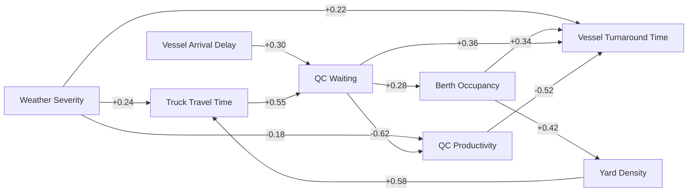

# Reference Causal Graph

The executable prototype graph contains eight nodes and twelve directed edges.



The positive cycle below represents a reinforcing congestion loop:

```text
QC Waiting
→ Berth Occupancy
→ Yard Density
→ Truck Travel Time
→ QC Waiting
```

Weather severity and vessel arrival delay are external context nodes. Vessel turnaround time is the broad outcome KPI; QC productivity remains an intermediate performance KPI.

The weights are synthetic ground truth for demonstrating propagation and weight recovery. They are not calibrated for a real terminal.
